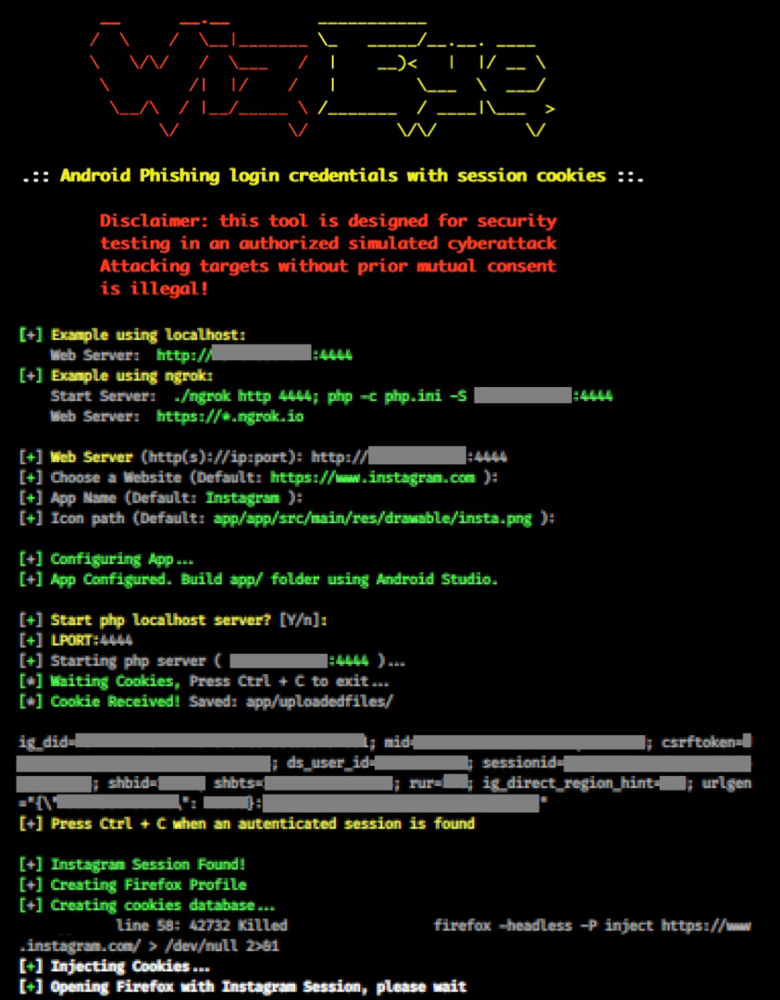

# WizEye v1.2
Man-in-the-middle phishing attack using an Android app to grab session cookies for any website, which in turn allows to bypass 2-factor authentication protection. WizEye brings as an example the hijacking and injection of cookies for authenticated instagram sessions.

## Instagram: https://instagram.com/programemerz



## Legal disclaimer:

Usage of WizEye for attacking targets without prior mutual consent is illegal. It's the end user's responsibility to obey all applicable local, state and federal laws. Developers assume no liability and are not responsible for any misuse or damage caused by this program 

### Requirement:
Android Studio

### Tested on Kali Linux 2020.1 x64:
```
# git clone https://github.com/thelinuxchoice/EvilApp
# cd EvilApp
# bash evilapp.sh
```
